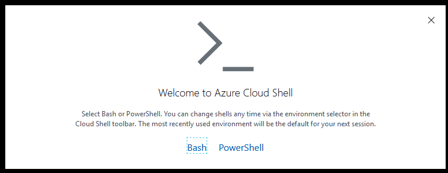
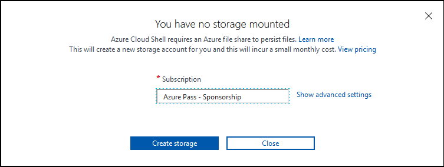
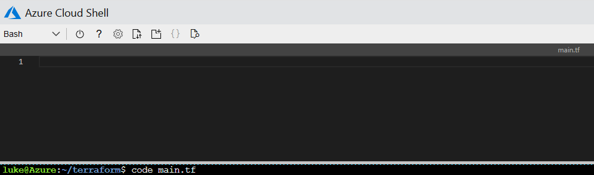

# Getting Started with Terraform on Azure: Deploying Resources

### Introduction

Terraform is an open source command line tool that allows users to deploy infrastructure to multiple environments and systems including AWS, Azure, GCP, and even on-premise vSphere. It has a platform agnostic approach that doesn't require programming knowledge. This makes it easy enough for most people to become proficient with Terraform in just 3 - 5 days. 

Not only is Terraform easy to learn, but it is also very universal. Terraform uses *providers* to interact with the API's of various Cloud providers, PaaS services, SaaS services, and on premise resources. There are currently [121 providers](https://www.terraform.io/docs/providers/index.html) on Terraform's official website and the number is increasing steadily. One of the key benefits of Terraform is that it allows for teams to have the power to declaratively deploy infrastructure to multiple systems with a single tool.

Terraform is a great way to start your Infrastructure as Code journey in Azure. It's an agentless tool, meaning agent software is never installed on deployed resources. It is also masterless, so no need to set up a management server, you can get started within just minutes. In this guide we are going use Terraform to deploy resources to Azure using Azure CloudShell. 

## Prerequisites

Before you begin, you'll need an [Azure subscription](https://azure.microsoft.com/en-us/). Create a free account or use an existing sandbox subscription.

We will be using the Azure Cloud Shell as Terraform already comes preinstalled in this environment and is the fastest way to get started. To launch Azure Cloud Shell, browse to [shell.azure.com](https://shell.azure.com). Select either **Bash** or **PowerShell**. This will bring up a Linux container environment with a command line interface to either tool you select. In this example we will use **Bash**:



Next, choose the desired subscription to store our Cloud Shell resources in and select **Create Storage**. This will create a storage account in that subscription which will be used to store our user session data for CloudShell:




Wait a few minutes for Azure to provision the storage account. Once completed, we will be redirected to our Azure Cloud Shell environment. To verify the subscription our Cloud Shell environment is using, we can type the following command:

```
az account show
```
If your using the incorrect subscription, or would like to deploy infrastructure to another subscription, type in the following syntax and specify the name or ID of the desired subscription to switch to in the Azure Cloud Shell console:
```
az account set -s "my subscription name"
```

Now we are ready to start deploying infrastructure using Terraform

## Step 1 — Create a Terraform Config File

Terraform code is written in HCL, also known as Hashicorp Configuration Language, which is designed to be human readable and simple to understand. It's also a *declarative language*, meaning that we declare what we want to be built and Terraform figures out how to build it and "makes it so". For example, if we declare in HCL code that we want two virtual machines, Terraform will build them. However, if we change our mind later and decide we only need one, we simply remove the 2nd virtual machine from the code. Terraform will then remove the 2nd virtual machine from the environment because it is no longer in code. This is important to understand when designing your Terraform configurations. 

The Terraform code is stored in *configuration files* that are files with a `*.tf` extension. These files can be created in any text editor, in this example we will be using the integrated file editor inside of Azure Cloud Shell to create and edit our configuration files.

To get started lets make a directory in our Azure Cloud Shell called `terraform` and then change our directory to that folder:

``mkdir terraform && cd $_``

Next, we will create a `main.tf` file to deploy a resource group to our Azure subscription. In Azure Cloud Shell type the following command while in the newly created `terraform` directory:

`code main.tf`

This creates a file named `main.tf` and opens an integrated file editor that we can use to create our configuration file in Azure Cloud Shell. There are more efficient ways to develop Terraform configurations, like using Visual Studio Code with the Terraform extension. However, for the ease of this guide, we will use the integrated file editor in Azure Cloud Shell:



In Terraform the syntax is simple. We declare the components we want to create by defining *blocks* and *arguments* in the following format:
```
<BLOCK TYPE> "<BLOCK LABEL>" "<BLOCK LABEL>" {
  # Block body
  <IDENTIFIER> = <EXPRESSION> # Argument
}
```
The first block we are going to create is the provider block. This block specifies the provider we will use. Like I mentioned previously, providers allow for Terraform to interact with the API's of the environment we are deploying to. In this case we are using the Azure provider. Many providers are maintained by the vendors themselves. However, the Azure provider has a small team of developers at Hashicorp that are dedicated to maintaining it. In our Terraform configuration, we need to specify that we want to use the Azure provider to deploy our resources. A basic Azure provider block looks like the following:

```
provider "azurerm" {
  version = "1.38.0"
}
```

The provider block contains the information on the type of provider we would like to use. It also only requires a single block label. The `auzrerm` provider is the name of the provider we will be specifying in the parameter string. In this example `version = "1.38.01` is our only argument. We are stating that we only want version 1.38 of the provider. It is recommended to always include the version on your provider blocks as future releases of the provider may break Terraform code.

Typically the provider is also the way that we authenticate with that system. In our example we are using Azure Cloud Shell and are already authenticated so there is no need to specify any sort of additional arguments for authenticating. However, if we were running Terraform in a different environment like a laptop or CI/CD pipeline, we would need to either use Azure CLI, a Service Principle Account, or Managed Service Identity for authentication. Check out the documentation for more information on ways to [authenticate with the azurerm provider](https://www.terraform.io/docs/providers/azurerm/index.html#authenticating-to-azure). Also, we can use multiple providers in a single configuration file. So if we needed to span multiple systems or clouds in one configuration we would start by specifying the provider and authentication arguments for each system.

Now that we've gone over the provider block, our next block to create is the resource block. Resource blocks are for the infrastructure objects that we want to declare. In our example we want to create a resource group named **rg-MyFirstTerraform** in the **westus** region. We are defining this infrastructure in a resource block and the syntax looks like the following: 

```
resource "azurerm_resource_group" "rg" {
    name     = "rg-MyFirstTerraform"
    location = "westus"
}
```

The resource block contains two sets of string parameters. The first string parameter represents the *resource type*, which in our case is the `azurerm_resource_group` type. For a list of available types of resources to create, check out the [azurerm provider documentation](https://www.terraform.io/docs/providers/azurerm/). The second string parameter is the *resource name*. The resource name is the name that we are labeling that resource within the Terraform configuration and must be unique for each resource type that is created. So we can't have two `azurerm_resource_group` resource types with the name `rg` in a single configuration. 

Now we have a complete Terraform configuration that enables us to deploy our resource group into Azure. Copy the following configuration file syntax below and paste it into our Azure Cloud Shell editor:

```
provider "azurerm" {
  version = "1.38.0"
}

#create resource group
resource "azurerm_resource_group" "rg" {
    name     = "rg-MyFirstTerraform"
    location = "westus"
}
```

To save our code to the `main.tf` file in the Cloud Shell integrated editor, press the `CTRL + S` keys. Next, press `CTRL + Q` to close out of the editor. We've now created our first configuration file. In the next section we will deploy it.

## Step 2 — Init, Apply, Plan, and Destroy

The first step to deploying our configuration is to *initialize* our configuration. This process will create a hidden `.terraform` folder that contains our plugins. Our providers will automatically be downloaded and as you will see, each provider in Terraform has its own binary file. Run the following command inside the `terraform` directory to perform the initialization:

`terraform init`

We can see that the azurerm provider plugin binary for version 1.38 is downloaded:

```
Initializing the backend...

Initializing provider plugins...
- Checking for available provider plugins...
- Downloading plugin for provider "azurerm" (hashicorp/azurerm) 1.38.0...

Terraform has been successfully initialized!

You may now begin working with Terraform. Try running "terraform plan" to see
any changes that are required for your infrastructure. All Terraform commands
should now work.

If you ever set or change modules or backend configuration for Terraform,
rerun this command to reinitialize your working directory. If you forget, other
commands will detect it and remind you to do so if necessary.
```


Since our `terraform init` was successful, we will now run our *plan*. A plan is a way for terraform to essentially do a "dry run" on the configuration and provide detailed information on what the deployment would look like. This is a similar concept to running a "-whatif" in PowerShell. To run our plan, we will type in the following syntax:

`terraform plan`

We should now see our plan in the output. Each resource that will be affected is identified and listed in the output. Anything that is a new resource to be created will have a `+` next to it. You will see later when we destroy this resource it will have a `-` instead. Towards the bottom we can see the number of items added, changed, or destroyed is specified:

```
Refreshing Terraform state in-memory prior to plan...
The refreshed state will be used to calculate this plan, but will not be
persisted to local or remote state storage.


------------------------------------------------------------------------

An execution plan has been generated and is shown below.
Resource actions are indicated with the following symbols:
  + create

Terraform will perform the following actions:

  # azurerm_resource_group.rg will be created
  + resource "azurerm_resource_group" "rg" {
      + id       = (known after apply)
      + location = "westus"
      + name     = "rg-MyFirstTerraform"
      + tags     = (known after apply)
    }

Plan: 1 to add, 0 to change, 0 to destroy.

------------------------------------------------------------------------

Note: You didn't specify an "-out" parameter to save this plan, so Terraform
can't guarantee that exactly these actions will be performed if
"terraform apply" is subsequently run.

```

Finally, we can deploy our infrastructure by running our *apply*. This will display output similar to `terraform plan` and ask for confirmation to apply the configuration. To start, run the following syntax in the `terraform` directory:

`terraform apply`

A plan will be generated the same as when we ran `terraform plan`, review the plan and type `yes` to continue. The following output will be displayed indicating that our resource group was created:
```
azurerm_resource_group.rg: Creating...
azurerm_resource_group.rg: Creation complete after 2s [id=/subscriptions/5c80ecff-4dfe-4fa0-abd4-3c15c2e3be31/resourceGroups/rg-MyFirstTerraform]

Apply complete! Resources: 1 added, 0 changed, 0 destroyed.
```

Now that our resource group has been deployed, let's take a look at the *state file* that was created. The state file is a `*.tfstate` file that holds the current "state" of the resource we just created. This is how Terraform can keep track of changes that it has made or needs to make. 

```
$ dir
main.tf  terraform.tfstate

```

When we type `cat terraform.tfstate` to display its contents we can see the format and contents of our state file:
```
[secondary_label Output]
{
  "version": 4,
  "terraform_version": "0.12.18",
  "serial": 1,
  "lineage": "74f54b5d-2150-0d28-8631-2330f08a1586",
  "outputs": {},
  "resources": [
    {
      "mode": "managed",
      "type": "azurerm_resource_group",
      "name": "rg",
      "provider": "provider.azurerm",
      "instances": [
        {
          "schema_version": 0,
          "attributes": {
            "id": "/subscriptions/5c80ecff-4dfe-4fa0-abd4-3c15c2e3be31/resourceGroups/rg-MyFirstTerraform",
            "location": "westus2",
            "name": "rg-MyFirstTerraform",
            "tags": {}
          },
          "private": "bnVsbA=="
        }
      ]
    }
  ]
}
```
The state file is meant to live for the entire life cycle of the resource and contains data on the infrastructure that has been provisioned. Because of this, it is highly recommended to store the state file in a remote location. This is a process called *remote state* which we will cover in a later article.

Let's try modifying our configuration and see what happens. We will add a tag to our resource group by modifying our `main.tf` file like so:

```
provider "azurerm" {
  version = "1.38.0"
}

#create resource group
resource "azurerm_resource_group" "rg" {
    name     = "rg-MyFirstTerraform"
    location = "westus"
    tags      = {
      Environment = "Terraform Demo"
    }
}

```
When we run our `terraform plan` we can see the plan output which shows any resources that are changed:
```
An execution plan has been generated and is shown below.
Resource actions are indicated with the following symbols:
  ~ update in-place

Terraform will perform the following actions:

  # azurerm_resource_group.rg will be updated in-place
  ~ resource "azurerm_resource_group" "rg" {
        id       = "/subscriptions/5c80ecff-4dfe-4fa0-abd4-3c15c2e3be31/resourceGroups/rg-MyFirstTerraform"
        location = "westus"
        name     = "rg-MyFirstTerraform"
      ~ tags     = {
          + "Environment" = "Terraform Demo"
        }
    }

Plan: 0 to add, 1 to change, 0 to destroy.
```
The `~` indicates a resource that will be *updated in place* meaning an argument will be modified without having to remove the resource and rebuild it. Before we apply the change. Let's modify the config file again and change our resource group to exist in the `westus2` region:

```
provider "azurerm" {
  version = "1.38.0"
}

#create resource group
resource "azurerm_resource_group" "rg" {
    name     = "rg-MyFirstTerraform"
    location = "westus2"
    tags      = {
      Environment = "Terraform Demo"
    }
}
```

Now when we run `terraform plan` we can see the output:
```
An execution plan has been generated and is shown below.
Resource actions are indicated with the following symbols:
-/+ destroy and then create replacement

Terraform will perform the following actions:

  # azurerm_resource_group.rg must be replaced
-/+ resource "azurerm_resource_group" "rg" {
      ~ id       = "/subscriptions/5c80ecff-4dfe-4fa0-abd4-3c15c2e3be31/resourceGroups/rg-MyFirstTerraform" -> (known after apply)
      ~ location = "westus" -> "westus2" # forces replacement
        name     = "rg-MyFirstTerraform"
      ~ tags     = {
          + "Environment" = "Terraform Demo"
        }
    }

Plan: 1 to add, 0 to change, 1 to destroy.
```

We can see a  `-/+ ` next to the `azurerm_resource_group.rg` resource. This indicates that terraform will destroy this resource and then re-create it. Terraform already knows that we need to delete the resource group and build it in another region, and it will automatically handle the logistics for us. The `# forces replacement` note states that the location is the argument that is causing the resource to be completely replaced.

It is extremely important to understand how to properly read plan files when modifying infrastructure that is already deployed. Make sure you understand the effects of the changes you are making and if any downtime of the resource is required from the change. It is highly recommended to test changes in a development environment first since it's easy to copy the terraform code and deploy in another environment to test.

We run `terraform apply` and see that our resource group is moved to `westus2` (logs truncated for brevity):

```
...
azurerm_resource_group.rg: Still destroying... [id=/subscriptions/5c80ecff-4dfe-4fa0-abd4-...e31/resourceGroups/rg-MyFirstTerraform, 40s elapsed]
azurerm_resource_group.rg: Destruction complete after 48s
azurerm_resource_group.rg: Creating...
azurerm_resource_group.rg: Creation complete after 2s [id=/subscriptions/5c80ecff-4dfe-4fa0-abd4-3c15c2e3be31/resourceGroups/rg-MyFirstTerraform]
```


Let's tear down our newly deployed resource by running a *destroy*. This will delete all the items that we deployed using our Terraform configuration. So, in our example the resource group will be destroyed. Note that a destroy is not yet considered an action that should be performed on infrastructure that is in production. When running a destroy, there is no "undo button", the infrastructure is completely removed. We run a destroy by typing in the following command:

`terraform destroy`

We get another plan output indicating which resources will be destroyed indicated by a `-` next to them. Also we can see the `1 to destroy` in the plan section at the bottom:

```
An execution plan has been generated and is shown below.
Resource actions are indicated with the following symbols:
  - destroy

Terraform will perform the following actions:

  # azurerm_resource_group.rg will be destroyed
  - resource "azurerm_resource_group" "rg" {
      - id       = "/subscriptions/5c80ecff-4dfe-4fa0-abd4-3c15c2e3be31/resourceGroups/rg-MyFirstTerraform" -> null
      - location = "westus2" -> null
      - name     = "rg-MyFirstTerraform" -> null
      - tags     = {} -> null
    }

Plan: 0 to add, 0 to change, 1 to destroy.
```

Type `yes` to confirm the destroy. We should then get the following output displaying our resource group being destroyed:
```
azurerm_resource_group.rg: Destroying... [id=/subscriptions/5c80ecff-4dfe-4fa0-abd4-3c15c2e3be31/resourceGroups/rg-MyFirstTerraform]
azurerm_resource_group.rg: Still destroying... [id=/subscriptions/5c80ecff-4dfe-4fa0-abd4-...e31/resourceGroups/rg-MyFirstTerraform, 10s elapsed]
azurerm_resource_group.rg: Still destroying... [id=/subscriptions/5c80ecff-4dfe-4fa0-abd4-...e31/resourceGroups/rg-MyFirstTerraform, 20s elapsed]
azurerm_resource_group.rg: Still destroying... [id=/subscriptions/5c80ecff-4dfe-4fa0-abd4-...e31/resourceGroups/rg-MyFirstTerraform, 30s elapsed]
azurerm_resource_group.rg: Still destroying... [id=/subscriptions/5c80ecff-4dfe-4fa0-abd4-...e31/resourceGroups/rg-MyFirstTerraform, 40s elapsed]
azurerm_resource_group.rg: Destruction complete after 47s

Destroy complete! Resources: 1 destroyed.
```

Now we have successfully created and destroyed a resource group in Azure using Terraform. Let's move on to deploying something more exciting. In the next step we will deploy a virtual machine.


## Step 3 — Deploying a Virtual Machine

In Azure, a virtual machine has a few resources that are required in order to build one. We will create a resource in Terraform for the following resources:

- Resource group
- Virtual network
- Subnet
- Network Interface
- Virtual Machine

We already have the code for the resource group from the previous step. Let's add the following code to the `main.tf` for our virtual network:

```
resource "azurerm_virtual_network" "vnet" {
    name                = "vnet-dev-westus2-001"
    address_space       = ["10.0.0.0/16"]
    location            = "westus2"
    resource_group_name = azurerm_resource_group.rg.name
}
```
We are using the `azurerm_virtual_network` resource type with the `vnet` resource name. Notice the `address_space` value is surrounded in bracket squares `[]`. This indicates that the value type is a list and can contain multiple comma separated values. For example we could put in more than one address space such as `["10.0.0.0/16,10.1.0.0/16"]` however for this example we will just be using one. Lastly, we will point out the `azurerm_resource_group.rg.name` expression. It is referencing the value of another resource's attributes. In this case we are referencing our `azurerm_resource_group` type with the resource name of `rg` and its `name` attribute. The value of the `name` attribute is `rg-MyFirstTerraform` in our example. Referencing the attribute of our resource like this allow us to build upon information within our resources. Because we are referencing the name value of our resource group, Terraform will automatically know to build the resource group first. This is called an *implicit dependency*.

Next, we will add the subnet, network security group, public IP, and virtual machine resources to our config. The complete configuration should look like this. Copy the following below and paste it into the Azure Cloud Shell editor to overwrite our `main.tf` to include these changes:

```
provider "azurerm" {
  version = "1.38.0"
}

#create resource group
resource "azurerm_resource_group" "rg" {
    name     = "rg-MyFirstTerraform"
    location = "westus2"
    tags      = {
      Environment = "Terraform Demo"
    }
}

#Create virtual network
resource "azurerm_virtual_network" "vnet" {
    name                = "vnet-dev-westus2-001"
    address_space       = ["10.0.0.0/16"]
    location            = "westus2"
    resource_group_name = azurerm_resource_group.rg.name
}

# Create subnet
resource "azurerm_subnet" "subnet" {
  name                 = "snet-dev-westus2-001 "
  resource_group_name  = azurerm_resource_group.rg.name
  virtual_network_name = azurerm_virtual_network.vnet.name
  address_prefix       = "10.0.0.0/24"
}

# Create public IP
resource "azurerm_public_ip" "publicip" {
  name                = "pip-vmterraform-dev-westus2-001"
  location            = "westus2"
  resource_group_name = azurerm_resource_group.rg.name
  allocation_method   = "Static"
}


# Create network security group and rule
resource "azurerm_network_security_group" "nsg" {
  name                = "nsg-sshallow-001 "
  location            = "westus2"
  resource_group_name = azurerm_resource_group.rg.name

  security_rule {
    name                       = "SSH"
    priority                   = 1001
    direction                  = "Inbound"
    access                     = "Allow"
    protocol                   = "Tcp"
    source_port_range          = "*"
    destination_port_range     = "22"
    source_address_prefix      = "*"
    destination_address_prefix = "*"
  }
}

# Create network interface
resource "azurerm_network_interface" "nic" {
  name                      = "nic-01-vmterraform-dev-001 "
  location                  = "westus2"
  resource_group_name       = azurerm_resource_group.rg.name
  network_security_group_id = azurerm_network_security_group.nsg.id

  ip_configuration {
    name                          = "niccfg-vmterraform"
    subnet_id                     = azurerm_subnet.subnet.id
    private_ip_address_allocation = "dynamic"
    public_ip_address_id          = azurerm_public_ip.publicip.id
  }
}

# Create virtual machine
resource "azurerm_virtual_machine" "vm" {
  name                  = "vmterraform"
  location              = "westus2"
  resource_group_name   = azurerm_resource_group.rg.name
  network_interface_ids = [azurerm_network_interface.nic.id]
  vm_size               = "Standard_B1s"

  storage_os_disk {
    name              = "stvmpmvmterraformos"
    caching           = "ReadWrite"
    create_option     = "FromImage"
    managed_disk_type = "Premium_LRS"
  }

  storage_image_reference {
    publisher = "Canonical"
    offer     = "UbuntuServer"
    sku       = "16.04.0-LTS"
    version   = "latest"
  }

  os_profile {
    computer_name  = "vmterraform"
    admin_username = "terrauser"
    admin_password = "Password1234!"
  }

  os_profile_linux_config {
    disable_password_authentication = false
  }
}

```

Notice we have our password in plain text in the configuration file. This is not best practice and we are only doing it to demonstrate deploying the virtual machine. We will fix that issue in a later article. Now, let's run `terraform init` to initialize our directory. Next, we will run our plan, but we will use the `-out` parameter to output our plan to a file. Typically, this is the best practice for automating Terraform in a CI/CD pipeline. This allows for additional unit testing steps to be run against the plan file before deployment. It also guarantees our actions in the plan when we run `terraform apply` against the plan file. In this example we named the plan file `tfvm`, but it can be named anything that makes logical sense for the environment we are deploying. We will run `terraform plan` and create our plan file. The syntax is below:

`terraform plan -out=tfvm`

Once the plan is successful, the plan file is created. With the command `terraform show` we can specify our plan file name and review the plan or even have another team member review it:
```
terraform show tfvm

An execution plan has been generated and is shown below.
Resource actions are indicated with the following symbols:
  + create

Terraform will perform the following actions:

  # azurerm_network_interface.nic will be created
  + resource "azurerm_network_interface" "nic" {
      + applied_dns_servers           = (known after
...
```
We could also take this plan file and use `terraform show -json tfvm` to get our plan in a JSON format. This opens a lot of doors for automating the review of our plan. For example, we could then take the JSON file of our plan and use PowerShell's `convertfrom-json` cmdlet to convert it into a PowerShell Object and perform customized Pester testing against our plan files. Also note that these plan files are not encrypted and may possibly contain secrets or passwords in them. It's not best practice to store these and they should only temporarily exist. There are plans on the Terraform roadmap to make these plan files more secure in the future.

Next, we will run our `terraform apply` against the actions in the plan file by specifying the file name. Notice that we won't be prompted to confirm that we want to apply the changes when we run apply this way:

`terraform apply tfvm`

We should immediately see the infrastructure starting to build:

```
azurerm_resource_group.rg: Creating...
azurerm_resource_group.rg: Creation complete after 1s [id=/subscriptions/5c80ecff-4dfe-4fa0-abd4-3c15c2e3be31/resourceGroups/rg-MyFirstTerraform]
azurerm_virtual_network.vnet: Creating...
azurerm_public_ip.publicip: Creating...
azurerm_network_security_group.nsg: Creating...
azurerm_public_ip.publicip: Creation complete after 6s [id=/subscriptions/5c80ecff-4dfe-4fa0-abd4-3c15c2e3be31/resourceGroups/rg-MyFirstTerraform/providers/Microsoft.Network/publicIPAddresses/pip-vmterraform-dev-westus2-001]
```
When our deployment is complete, we will see the following message:
```
Apply complete! Resources: 7 added, 0 changed, 0 destroyed.
```
This is where you can start to see the power of Terraform. In a few minutes we have deployed a Virtual Machine with a subnet, virtual network, and public IP address. 

Now that our virtual machine is deployed, lets destroy our infrastructure using a destroy. Like I stated before, this typically is only done in dev and sandbox environments. Now let's destroy our infrastructure, but this time we will use a different method. We will create a *destroy plan* which will create a plan file, meant for destroying infrastructure, which we will then run `terraform apply` against. To do this run the following commands:

```
terraform plan -destroy -out=tfvmdestroy
```

After carefully reviewing our destroy, we can apply the destroy plan file:

```
terraform apply tfvmdestroy
```

Now our infrastructure will start to tear down displaying snippets of output like below:
```
...
azurerm_virtual_machine.vm: Still destroying... [id=/subscriptions/5c80ecff-4dfe-4fa0-abd4-...ft.Compute/virtualMachines/vmterraform, 1m30s elapsed]
azurerm_virtual_machine.vm: Destruction complete after 1m31s
azurerm_network_interface.nic: Destroying... [id=/subscriptions/5c80ecff-4dfe-4fa0-abd4-3c15c2e3be31/resourceGroups/rg-MyFirstTerraform/providers/Microsoft.Network/networkInterfaces/nic-01-vmterraform-dev-001]
azurerm_network_interface.nic: Still destroying... [id=/subscriptions/5c80ecff-4dfe-4fa0-abd4-...kInterfaces/nic-01-vmterraform-dev-001, 10s elapsed]
azurerm_network_interface.nic: Still destroying... [id=/subscriptions/5c80ecff-4dfe-4fa0-abd4-...kInterfaces/nic-01-vmterraform-dev-001, 20s elapsed]
...
```
Once all of our infrastructure is completely destroyed, we will see the following message:
```
Apply complete! Resources: 0 added, 0 changed, 7 destroyed.
```

Now you can see how quickly we can build and tear down infrastructure with Terraform in a matter of minutes. 

## Conclusion

In this article we learned how to create Terraform configuration files. We reviewed the concepts of the init, plan, apply, and destroy commands that are most commonly used for deploying Terraform configuration files. We also successfully deployed a virtual machine into Azure with all its networking components. Terraform is a very powerful tool and greatly improves consistency and efficiency with managing infrastructure. Now imagine using the same process we used to deploy infrastructure in Azure with another cloud or on-premise VMware environment (using different providers and resource blocks). 

In the next article we will go even further into deploying virtual machines by using provisioners to customize resources after they are deployed. 

